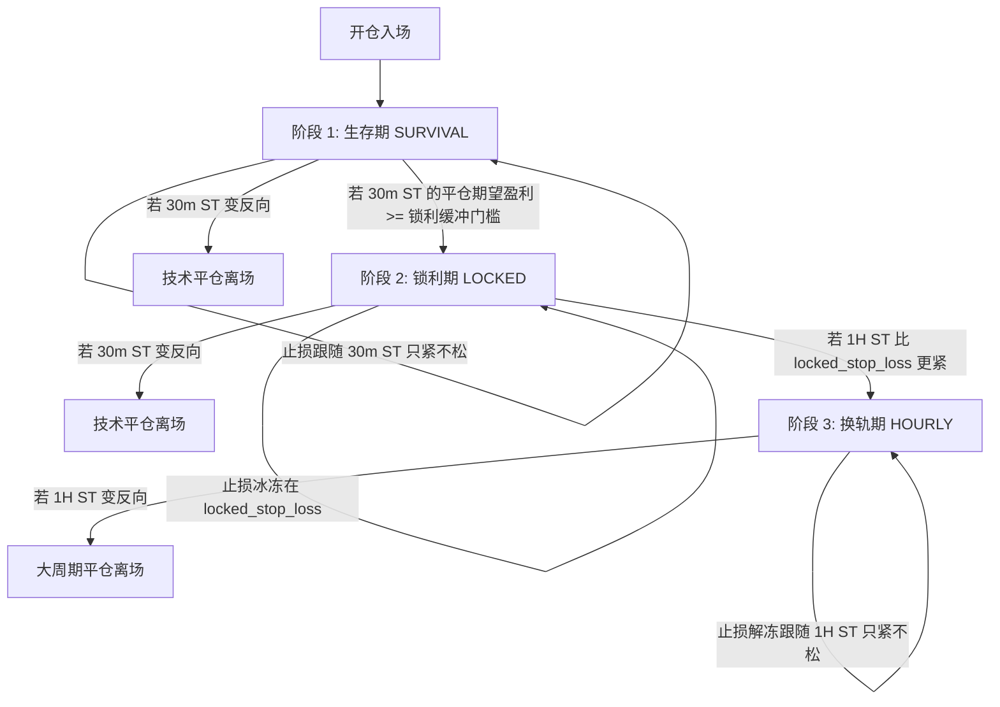

# 📈 SOL/ETH 永续合约趋势交易策略 (V9.6-Exec / V9.7-Backtest) 完整 SOP

本文档详尽整理并规范了本交易系统的最新核心交易策略、技术指标计算、三阶段动态止损管理、仓位计算公式、风控熔断机制以及实盘执行的标准作业程序（SOP）。

---

## 🎯 策略概述与核心设计

本策略是基于 **SuperTrend (超级趋势)** 和 **DEMA200 (双倍指数移动平均线)** 的多周期趋势追踪交易系统，并配备了 **ADX (平均趋向指标)** 趋势强度过滤器。
- **运行周期**: 30分钟（30m）作为信号/执行周期，1小时（1H）作为大趋势过滤周期。
- **数据源安全**: 系统始终使用已收盘的 K 线数据（即 Pandas 数据帧中的 `iloc[-2]`），杜绝因实时 K 线未收盘而导致的信号漂移或回测前瞻偏差（Lookahead Bias）。
- **DEMA 精度优化**: 使用 1000 根 K 线计算 DEMA200，保证其与 TradingView 官方指标的计算精度对齐度达 **99.99%**（误差控制在 0.07 点以内）。

---

## 📊 1. 技术指标配置与计算逻辑

### 1.1 核心参数对照表

| 指标名称 | 参数项 | 推荐默认值 | 作用说明 |
| :--- | :--- | :--- | :--- |
| **SuperTrend (30m)** | `ATR Period`<br>`Multiplier` | `10`<br>`3.0` | **入场执行与生存期/锁利期止损源**。指示局部波段方向与支撑/阻力位。 |
| **SuperTrend (1H)** | `ATR Period`<br>`Multiplier` | `10`<br>`3.0` | **大周期趋势过滤器与换轨期止损源**。指示大级别波段方向。 |
| **DEMA (1H)** | `Period` | `200` | **多空强弱分水岭**。大级别多头/空头趋势边界过滤器。 |
| **ADX (1H / 30m)** | `Length`<br>`Threshold` | `16` (实盘) / `14` (回测)<br>`30` (实盘) / `20` (回测) | **趋势强度过滤器**。当 ADX 大于阈值时才允许开仓，防止在震荡盘整市中被频繁“双边打脸”。 |

### 1.2 指标计算公式与原理

#### 1.2.1 SuperTrend 计算
SuperTrend 指标完全对准 TradingView 的 PineScript 算法实现，其核心是由 ATR 计算通道线，并随着价格对轨道的突破而切换方向：
1. **True Range (TR)**: 
   $$TR = \max(\text{High} - \text{Low}, |\text{High} - \text{Close}_{\text{prev}}|, |\text{Low} - \text{Close}_{\text{prev}}|)$$
2. **ATR (RMA / Wilder's Smoothing)**: 
   使用递推平滑算法，平滑系数为 $\alpha = \frac{1}{\text{Period}}$:
   $$\text{ATR}_t = \alpha \cdot TR_t + (1 - \alpha) \cdot \text{ATR}_{t-1}$$
3. **基础轨道线 (Basic Bands)**:
   $$\text{Basic Up} = \frac{\text{High} + \text{Low}}{2} - \text{Multiplier} \cdot \text{ATR}$$
   $$\text{Basic Dn} = \frac{\text{High} + \text{Low}}{2} + \text{Multiplier} \cdot \text{ATR}$$
4. **最终轨道线 (Final Bands)**:
   - 若 $\text{Close}_{\text{prev}} > \text{Up}_{\text{prev}}$，则 $\text{Up} = \max(\text{Basic Up}, \text{Up}_{\text{prev}})$，否则 $\text{Up} = \text{Basic Up}$。
   - 若 $\text{Close}_{\text{prev}} < \text{Dn}_{\text{prev}}$，则 $\text{Dn} = \min(\text{Basic Dn}, \text{Dn}_{\text{prev}})$，否则 $\text{Dn} = \text{Basic Dn}$。
5. **趋势方向 (Trend Direction)**:
   - 若前一周期为看空且当前收盘价向上突破阻力轨 $\text{Dn}_{\text{prev}}$，趋势转为多头（`1`）。
   - 若前一周期为看多且当前收盘价跌破支撑轨 $\text{Up}_{\text{prev}}$，趋势转为空头（`-1`）。
   - 否则，维持前一周期的趋势方向。

#### 1.2.2 DEMA (双倍指数移动平均线)
DEMA 相比普通 EMA 具有极低的滞后性。计算公式如下：
$$\text{EMA}_1 = \text{EMA}(\text{Close}, N)$$
$$\text{EMA}_2 = \text{EMA}(\text{EMA}_1, N)$$
$$\text{DEMA} = 2 \cdot \text{EMA}_1 - \text{EMA}_2$$
*注：本系统要求至少读取 1000 根已收盘的 1H K 线（约 42 天数据）计算 DEMA200，以确保初始权重的衰减足够彻底，逼近 TradingView 99.99% 的计算准确度。*

#### 1.2.3 ADX 过滤器计算
1. 计算方向变动值（Directional Movement, $+DM$ 和 $-DM$）：
   $$\text{Up} = \text{High} - \text{High}_{\text{prev}}$$
   $$\text{Down} = \text{Low}_{\text{prev}} - \text{Low}$$
   $$+DM = \text{Up} \text{ if } (\text{Up} > \text{Down} \text{ and } \text{Up} > 0) \text{ else } 0.0$$
   $$-DM = \text{Down} \text{ if } (\text{Down} > \text{Up} \text{ and } \text{Down} > 0) \text{ else } 0.0$$
2. 使用 $\text{RMA}(N)$ 对 $TR$, $+DM$, $-DM$ 进行平滑，计算方向指示器 $\text{DI}+$ 和 $\text{DI}-$:
   $$\text{DI}+ = 100 \cdot \frac{\text{RMA}(+DM, N)}{\text{RMA}(TR, N)}$$
   $$\text{DI}- = 100 \cdot \frac{\text{RMA}(-DM, N)}{\text{RMA}(TR, N)}$$
3. 计算趋向指数 $\text{DX}$ 和平均趋向指数 $\text{ADX}$:
   $$\text{DX} = 100 \cdot \frac{|\text{DI}+ - \text{DI}-|}{\text{DI}+ + \text{DI}-}$$
   $$\text{ADX} = \text{RMA}(\text{DX}, N)$$
- **趋势有效判定**: 若全局开关 `USE_ADX = true`，则必须满足 $\text{ADX} > \text{ADX\_THRESHOLD}$，否则不开仓且不反手。

---

## 🚀 2. 交易信号与执行规则

### 2.1 开仓判定信号 (三重过滤)

当机器人**无任何持仓**时，每 30 分钟收盘执行一次检测：

#### 🟢 趋势做多信号 (Open Long)
1. **1H 趋势过滤**: 上一根完整 1H K 线的 SuperTrend 方向为**多头（绿色，`1`）**。
2. **1H 均线过滤**: 上一根完整 1H K 线的**收盘价** > **DEMA200**。
3. **30m 入场时机**: 上一根完整 30m K 线的 SuperTrend 方向为**多头（绿色，`1`）**。
4. **ADX 趋势过滤**: $\text{ADX} > \text{ADX\_THRESHOLD}$（当 ADX 开启时）。

#### 🔴 趋势做空信号 (Open Short)
1. **1H 趋势过滤**: 上一根完整 1H K 线的 SuperTrend 方向为**空头（红色，`-1`）**。
2. **1H 均线过滤**: 上一根完整 1H K 线的**收盘价** < **DEMA200**。
3. **30m 入场时机**: 上一根完整 30m K 线的 SuperTrend 方向为**空头（红色，`-1`）**。
4. **ADX 趋势过滤**: $\text{ADX} > \text{ADX\_THRESHOLD}$（当 ADX 开启时）。

---

### 2.2 离场与反手逻辑 (Reverse Rule)

当机器人**持有仓位**时，每次分析除了根据当前止损单自动离场外，还会主动检查技术离场与反手逻辑。

```
                    ┌──────────────────────────┐
                    │     持仓中 (分析信号)     │
                    └──────────────────────────┘
                                 │
                     是否触发当前阶段的离场条件?
                                 ├─── 否 ──→ 继续持仓 (Hold)
                                 │
                                 ├─── 是
                                 │    ↓
                      平仓并进行【反手检测】
                                 │
                     ┌───────────┴───────────┐
                     │ 是否满足反方向开仓条件 │
                     │   并且不在冷静期中?   │
                     └───────────┬───────────┘
                                 │
                         ┌───────┴───────┐
                         │               │
                       满足 (Yes)     不满足 (No)
                         │               │
                         ↓               ↓
                  执行平仓并立即开反向仓    仅执行平仓 (Close)
                  (Close and Reverse)     进入平仓观察状态
```

#### 2.2.1 技术平仓条件表

| 当前持仓 | 当前止损阶段 | 触发平仓的信号 |
| :--- | :--- | :--- |
| **多仓 (Long)** | **生存期** (SURVIVAL) 或 **锁利期** (LOCKED) | 上一根 30m K 线的 SuperTrend 变红（看空） |
| **多仓 (Long)** | **换轨期** (HOURLY) | 上一根 1H K 线的 SuperTrend 变红（看空） |
| **空仓 (Short)**| **生存期** (SURVIVAL) 或 **锁利期** (LOCKED) | 上一根 30m K 线的 SuperTrend 变绿（看多） |
| **空仓 (Short)**| **换轨期** (HOURLY) | 上一根 1H K 线的 SuperTrend 变绿（看多） |

#### 2.2.2 反手条件与动作定义
- **平多反手开空**: 持有多仓时，若触发平仓，且此时 **1H ST 为红** AND **1H 收盘 < DEMA200** AND **30m ST 为红** AND **ADX > 阈值** AND **不在冷静期内** $\rightarrow$ 执行“平多反手开空” (`close_and_reverse_short`)。
- **平空反手开多**: 持有空仓时，若触发平仓，且此时 **1H ST 为绿** AND **1H 收盘 > DEMA200** AND **30m ST 为绿** AND **ADX > 阈值** AND **不在冷静期内** $\rightarrow$ 执行“平空反手开多” (`close_and_reverse_long`)。
- **只平仓不反手**: 若触发平仓，但反向技术条件不齐，或处于冷静期 $\rightarrow$ 仅平仓并重置持仓状态 (`close`)。

---

## 🔒 3. 三阶段动态止损管理 (V2)

这是策略的最核心改进，实现了“生存期、锁利期、换轨期”的严谨划分和“只紧不松”原则，动态管理交易所的条件止损单（Stop-Loss Order）。

### 3.1 阶段推导的核心原则与过渡流程



---

### 3.2 三阶段参数与执行逻辑细节

#### 3.2.1 锁定止损计算依据
当仓位确立后，我们将计算该仓位对应的**保底锁利切换价格**（即按该价位平仓时，能获得 $\ge \text{LOCK\_PROFIT\_BUFFER}$ 的净收益）：
- **多仓锁定阈值**: 
  $$\text{Lock Threshold} = \text{Entry Price} + \frac{\text{LOCK\_PROFIT\_BUFFER}}{\text{Qty} \cdot \text{FACE\_VALUE}}$$
- **空仓锁定阈值**: 
  $$\text{Lock Threshold} = \text{Entry Price} - \frac{\text{LOCK\_PROFIT\_BUFFER}}{\text{Qty} \cdot \text{FACE\_VALUE}}$$
*其中 `LOCK_PROFIT_BUFFER` 默认为 1 USDT，用于保本；在实盘中推荐设为 10-15 USDT 以获取更稳健的利润空间。*

#### 3.2.2 阶段 1: 生存期 (SURVIVAL)
- **触发条件**: 仓位期望平仓盈利（按上一根 30m ST 指标价止损） $< \text{LOCK\_PROFIT\_BUFFER}$。
- **止损行为**: 止损跟随 **30m SuperTrend** 变化。
- **调整规则**: 遵循“只紧不松”（多单：取大值；空单：取小值）：
  - 多仓: $\text{SL}_{\text{new}} = \max(\text{ST}_{30\text{m}}, \text{SL}_{\text{current}})$
  - 空仓: $\text{SL}_{\text{new}} = \min(\text{ST}_{30\text{m}}, \text{SL}_{\text{current}})$
- **技术离场**: 30m SuperTrend 出现相反颜色信号。

#### 3.2.3 阶段 2: 锁利期 (LOCKED)
- **触发条件**: 30m SuperTrend 已经移动至开仓价有利方向，且按其止损的期望盈利 $\ge \text{LOCK\_PROFIT\_BUFFER}$；但 1H SuperTrend 尚未比锁利止损更紧。
- **止损行为**: **锁定止损价位**（将该时刻的 30m ST 写入 `position_state.json` 中的 `locked_stop_loss`）。
- **调整规则**: 止损在这个阶段保持冰冻，不跟随 30m ST 波动（防止大波动回撤打掉大部分盈利），为换轨期腾出空间。
  - 多仓: $\text{SL} = \text{locked\_stop\_loss}$ (如果 30m ST 强行回调，不调松止损)
  - 空仓: $\text{SL} = \text{locked\_stop\_loss}$
- **技术离场**: 30m SuperTrend 出现相反颜色信号。

#### 3.2.4 阶段 3: 换轨期 (HOURLY)
- **触发条件**: 1H SuperTrend 的点位比锁定止损 `locked_stop_loss` 更紧：
  - 多单: $\text{ST}_{1\text{H}} > \text{locked\_stop\_loss}$
  - 空单: $\text{ST}_{1\text{H}} < \text{locked\_stop\_loss}$
- **止损行为**: 止损参考源切换至 **1H SuperTrend**。
- **调整规则**: 止损跟随 1H ST 变动，同样实施“只紧不松”过滤机制。
- **技术离场**: 1H SuperTrend 出现相反颜色信号。

---

## 💰 4. 仓位计算与杠杆设计

系统执行开仓或反手开仓时，会基于定义的风险金额和止损距离自动计算合理的下属张数，实现基于数学期望的科学仓位管理。

### 4.1 仓位计算公式

1. **计算止损距离 (Stop Loss Distance)**:
   $$\text{SL Distance} = |\text{Entry Price} - \text{Stop Loss (30m ST)}|$$
2. **计算开仓张数 (Contract Qty, 向下取整)**:
   $$\text{Qty} = \left\lfloor \frac{\text{Risk Amount}}{\text{SL Distance} \cdot \text{FACE\_VALUE}} \right\rfloor$$
   *其中：*
   - $\text{Risk Amount}$ 为单笔允许承受的最大亏损金额（单位：USDT）。
   - $\text{FACE\_VALUE}$ 为单张合约对应的代币数量（可在 `config.py` 中自动/手动配置）：
     - **SOL_USDT**: `1.0`
     - **ETH_USDT**: `0.01`
     - **BTC_USDT**: `0.0001`
     - **DOGE_USDT**: `10.0`
3. **实际交易指标推导**:
   - **实际持仓代币量**: $\text{Position Token Size} = \text{Qty} \cdot \text{FACE\_VALUE}$
   - **名义持仓价值**: $\text{Position Value} = \text{Position Token Size} \cdot \text{Entry Price}$
   - **杠杆 (LEVERAGE)**: 实盘设定为 **10x**。
   - **所需保证金**: $\text{Margin Required} = \frac{\text{Position Value}}{\text{LEVERAGE}}$
   - **实战最大风险**: $\text{Actual Risk} = \text{Qty} \cdot \text{FACE\_VALUE} \cdot \text{SL Distance} \le \text{Risk Amount}$

---

## 🛡️ 5. 风控与熔断冷静期机制

为应对极端行情和系统连续亏损，系统引入了多重保护机制。

### 5.1 资金熔断保护 (Circuit Breaker)
- **触发条件**: 账户本金净值 (Equity) $\le \text{CIRCUIT\_BREAKER\_EQUITY}$（默认 **350 USDT**）。
- **运行机制**: 
  - 每次调度第一步会调用接口获取账户本金；
  - 一旦触发熔断线，程序将直接拒绝发出任何交易/止损调整信号，并进入 **1 周 (168小时) 停手熔断期**。
  - 向 Telegram 报警，由交易员手动检查账户资产及策略风险。

### 5.2 亏损冷静期保护 (Loss Cooldown)
- **触发条件**: 连续遭遇 **3 笔 (`MAX_CONSECUTIVE_LOSSES`) 止损亏损**。
- **运行机制**:
  - **自动交易模式 (`ENABLE_AUTO_TRADING = true`)**: 平仓事件触发后，在本地 `cooldown_state.json` 文件中增量记录本币对的连亏计数；
  - **模拟信号模式 (`ENABLE_AUTO_TRADING = false`)**: 基于 Gate.io 合约平仓历史接口 (`get_position_closes`) 统计最近平仓记录中的连亏情况；
  - 触发后强制进入 **48小时冷静期**。在冷静期内，机器人不会发出任何开仓信号或反手信号，直至 48 小时冷静期自然结束。
  - 冷静期结束后，连亏计数清零。
  - **连亏计数自动归零**: 如果最近一次亏损平仓后，空仓期超过 48 小时，连亏计数在下一次检查时将自动归零。

### 5.3 风险额模式 (Risk Mode)
系统支持两种风控模式，通过环境变量 `RISK_MODE` 进行配置：
1. **固定金额模式 (`fixed`)**: 单笔交易最大允许承受亏损固定为 $\text{RISK\_FIXED\_AMOUNT}$ (默认 **10 USDT**)。
2. **百分比金额模式 (`percent`)**: 
   - 动态计算风险金额: $\text{Risk Amount} = \text{Equity} \cdot \text{RISK\_PERCENT}$（默认 **2%** 账户净值）。
   - 保守保护: 当账户 Equity 在 350U 到 500U 之间时，强制降级为固定 10U 的保守风险额。

---

## ⚙️ 6. 实盘 SOP 执行流程与配置

### 6.1 环境变量与配置参数 (`config.py`)

在容器/VPS 或 GitHub Actions 部署中，应通过以下环境变量来控制机器人的执行行为：

```bash
# ============ 交易所与接口凭证 ============
export GATE_API_KEY="your-api-key"
export GATE_API_SECRET="your-api-secret"
export TELEGRAM_BOT_TOKEN="your-telegram-token"
export TELEGRAM_CHAT_ID="your-telegram-chat-id"

# ============ 实盘与自动交易行为 ============
export ENABLE_AUTO_TRADING="false"   # 设为 true 开启实盘自动下单，默认 false 仅发送 Telegram 信号
export SYMBOL="SOL_USDT"              # 交易合约对，SOL_USDT 或 ETH_USDT
export RISK_MODE="fixed"             # 风险模式，fixed (固定) 或 percent (百分比)
export RISK_FIXED_AMOUNT="10.0"      # 固定模式单笔限额 (USDT)
export RISK_PERCENT="0.02"           # 百分比模式单笔上限 (2%)
export LOCK_PROFIT_BUFFER="15.0"     # 锁利期期望保底利润阈值 (USDT)，建议按策略波动调整为 10-20
export USE_ADX="true"                # 是否启用 ADX 趋势强度过滤开关

# ============ 调试与日志日志 ============
export DEBUG="1"                     # 显示核心策略推导调试信息
export GATE_DEBUG="1"                # 显示交易所接口交互及细节
export DEBUG_KLINE="1"               # 显示 K 线最后两根的时间戳，排查前瞻偏差
```

### 6.2 本地状态持久化设计

系统通过本地持久化 JSON 文件进行去重与状态跟踪，防止因频繁触发脚本导致异常下单或重复警告：
- **`trading_state_[contract].json`**:
  - `last_processed_30m_bar_ts`: 记录已处理完毕的上一根 30m K 线时间戳。若调度重复触发，直接跳过，起到了去重护航的作用。
  - `consecutive_losses`: 记录连亏次数。
- **`position_state_[contract].json`**:
  - 存储持仓信息：`phase` (当前所处三阶段)、`stop_loss` (当前跟踪止损点)、`locked_stop_loss` (进入锁利期锁定的止损参考价)、`initial_30m_st` (开仓时的 30m ST) 以及入场时间。
  - 在位置平仓或反手成功后，该文件对应方向的状态会被立即清空 (`clear_position_state`)。
- **`cooldown_state_[contract].json`**: 
  - 存储冷静期起止时间以及冷静期触发原因。

---

## 🧪 7. 策略验证与排查指南

### 7.1 验证命令

在发布或策略逻辑修改后，可通过运行以下自动化脚本和测试命令对逻辑进行审查：

```bash
# 1. 运行三阶段止损及转换矩阵单元测试
python tests/test_phase_logic_v2.py

# 2. 检查最近平仓和冷静期历史记录
python -c "from cooldown import format_recent_trades, GateClient; client=GateClient(); print(format_recent_trades(client, 'SOL_USDT'))"
```

### 7.2 核心故障排查排表

| 问题表现 | 诊断步骤 | 解决建议 |
| :--- | :--- | :--- |
| **无开仓信号** | 1. 检查日志是否有 `cooldown` 或 `circuit_breaker` 提示；<br>2. 检查 ADX 值是否小于阈值；<br>3. 验证 1H 均线（收盘价是否越过 DEMA200）。 | 若在冷静期，需等待 48 小时；若市场处于震荡盘整市（ADX 较低），指标过滤属正常现象。 |
| **止损不随 30m ST 移动** | 1. 确认当前持仓的阶段是否进入了 `LOCKED` (锁利期)；<br>2. 检查 1H ST 是否已越过锁定阈值。 | 处于锁利期时，止损会被冻结在 `locked_stop_loss` 上，直至 1H ST 更紧以切换到换轨期。 |
| **DEMA200 与 TV 产生偏差** | 1. 检查获取的 K 线长度是否为 1000 根；<br>2. 查看当前 K 线时间序列是否发生缺失。 | DEMA 依赖庞大历史数据积累精度。必须确保 `get_candlesticks` 参数 limit 设为 1000。 |
